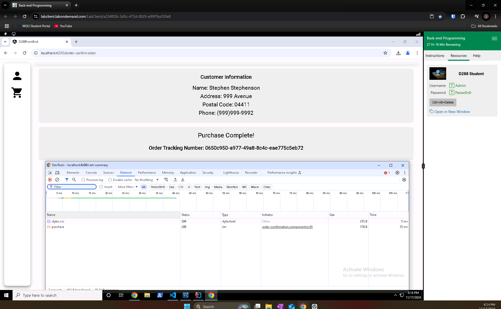

# Travel Booking API/Website Example

## Introduction

This project is a back-end migration of a legacy system into a modern Spring Framework Java-based web application. The goal is to port mission-critical functionality from an old system to a Spring-based solution, addressing bugs in the current Angular front-end, which interacts with the backend. The project was developed using the Spring Boot framework, MySQL database, and follows RESTful design principles.

This solution demonstrates my skills in modern software development and can be used as part of my portfolio for prospective employers.

## Technologies Used

- **Spring Boot**: Java framework for building the back-end of the web application.
- **Spring Data JPA**: For data persistence and interaction with the MySQL database.
- **MySQL**: Relational database used to store application data.
- **Lombok**: A Java library that reduces boilerplate code (e.g., getters, setters, constructors).
- **Angular**: Used as the front-end framework (pre-existing and not modified).
- **GitLab**: For version control and collaboration.

## Features

- **Spring Data JPA Repositories**: Facilitates seamless communication with the MySQL database.
- **REST API**: Provides endpoints for fetching vacation packages and submitting customer orders.
- **Customer Order System**: Allows customers to place orders with vacation packages and excursions.
- **Validation**: Ensures correct data input through validation mechanisms in the back-end.
- **Cross-Origin Support**: The application supports cross-origin requests from the Angular front-end.

## Requirements

This project is built based on the following dependencies:

- **Spring Data JPA**
- **Rest Repositories**
- **MySQL Driver**
- **Lombok**

### Dependencies

The following dependencies are included:

- **Spring Boot Starter Web**: For RESTful web services.
- **Spring Boot Starter Data JPA**: For integrating Spring Data JPA.
- **Spring Boot Starter Data REST**: For exposing repositories as RESTful services.
- **MySQL Driver**: For connecting to the MySQL database.
- **Lombok**: To reduce boilerplate code.

## Installation

1. Clone the repository:

```bash
git clone https://gitlab.com/your-repo/travel-booking-api.git
```

2. Import the project into IntelliJ IDEA (Ultimate Edition).

3. Ensure that the MySQL database is set up correctly, and the `application.properties` file is configured with the appropriate credentials.

4. Run the Spring Boot application:
```bash
./mvnw spring-boot:run
```

5. Access the REST API at: `http://localhost:8080/api/`.

## Functionality

### 1. **Entities and Database Interaction**

The following entities have been created for the system:

- **Cart**
- **CartItem**
- **Country**
- **Customer**
- **Division**
- **Excursion**
- **StatusType**
- **Vacation**

These entities map to the corresponding database tables and handle the core business logic related to vacation packages, customer orders, and excursions.

### 2. **REST Controllers**

- **CheckoutController**: Exposes a `POST` API for placing orders with customer details and selected vacation packages.

### 3. **Service Layer**

- **CheckoutService**: Contains the logic to manage customer orders, including validation and purchase response generation.
- **CheckoutServiceImpl**: Implements the service interface to handle business logic for checkout.
  
### 4. **Validation**

Validation has been added to ensure that inputs from the Angular front-end are correct before processing them in the back-end.

### 5. **Sample Data**

- A `BootStrapData` class is used to insert five sample customers into the database programmatically during startup to ensure the application works as expected.

## Running the Application

1. Launch the Spring Boot application. 
2. Use the pre-existing Angular front-end to place an order for a vacation with two excursions.
3. Inspect the database using MySQL Workbench to ensure that the data has been successfully added.
4. Verify that no network errors occur in the browser console.

### Screenshots




